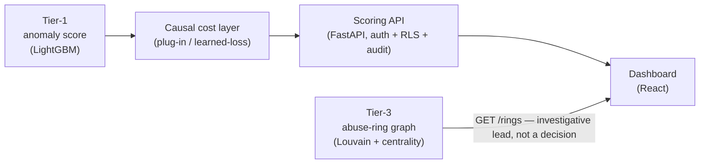

# RiskIQ

**Real-time fraud, chargeback and abuse-ring detection for payment platforms.**
Built for the Razorpay AI Buildathon 2026 — Track 2: AI Risk Manager.

Every payment processor faces the same trade-off: flag too little and fraud losses pile
up, flag too much and legitimate merchants churn over declined transactions. Most fraud
tools optimize for detection accuracy alone and ignore that trade-off entirely. RiskIQ
scores each transaction in real time, ranks it by **estimated dollar cost** rather than
raw fraud probability, and separately surfaces the coordinated account rings a
per-transaction model structurally cannot see — with every decision written to an
append-only audit trail an analyst can open and inspect. It is four independent layers,
not one opaque classifier, because a fraud system a risk team can't audit isn't one they
should trust.

**Live demo:** [ai-risk-manager-dun.vercel.app](https://ai-risk-manager-dun.vercel.app)

## Try it in under a minute

1. Open the [live demo](https://ai-risk-manager-dun.vercel.app).
2. In **Score a transaction**, leave the defaults (`acct-demo`, `$150.00`) and click
   **Score transaction** — a real decision comes back from the live model in the
   **Recent decisions** table below.
3. Click **Why? (analyst view)** on the result, or any row in **Recent decisions**, to see
   the reasoning behind a decision — and why full SHAP-level attribution is
   analyst-gated rather than open to every caller.
4. Scroll down for **Held-out evaluation**: the full confusion matrix, PR curve, and
   false-positive cost for every layer, measured on data the model never trained on.

## Architecture



| Layer | Role | Status |
|---|---|---|
| **Tier-1** — per-transaction anomaly score (LightGBM) | Carries the live scoring path | Shipped |
| **Tier-2** — per-account behavioral sequence model (LSTM autoencoder) | Built, measured, added nothing on held-out data | Tested, retired |
| **Tier-3** — transaction-network graph abuse-ring detection | The differentiator — finds coordinated rings a per-transaction model can't see | Shipped as an investigative lead, **provisional** (see below) |
| **Causal cost layer** — turns Tier-1's score into allow/review by estimated dollar cost, not a probability threshold | Shipped decision policy | Shipped |
| Meta-learner (XGBoost fusion of all three signals) | Tested, measurably *worse* than Tier-1 alone | Tested, retired |

Two layers were built, measured, and cut because the held-out numbers said they added
nothing — that result is reported here rather than hidden, since honesty about what
*doesn't* work is part of what makes the part that does work believable. Full detail in
`BUILD_LOG.md`.

## Key metrics (held-out test split, never live-demo traffic)

| Metric | Value |
|---|---|
| Tier-1 PR-AUC | **0.5276** (95% CI [0.5117, 0.5462], vs 0.0348 no-skill floor — 15.2x lift) |
| Cost saved vs. probability-only ranking | **22.41%** per 1,000 decisions, at a matched 1% flag rate |
| Fraud base rate | **3.48%** (3,083 of 88,581 rows) |
| Test set size | **n = 88,581** |

Every number above ships with its confidence interval and false-positive cost in the
dashboard's evaluation section — never presented as a single headline figure without the
confusion matrix behind it.

## Tech stack

| | |
|---|---|
| Backend | FastAPI, SQLAlchemy (async), PostgreSQL, Redis |
| ML | LightGBM, scikit-learn, NetworkX/igraph (Tier-3), SHAP, econml (causal cost) |
| Frontend | React + TypeScript (Vite), Tailwind |
| Deploy | Render (backend), Vercel (frontend) |

## Quick start (local)

```bash
cp backend/.env.example backend/.env    # then fill in the placeholders
docker compose up
```

| Service  | URL                            |
|----------|--------------------------------|
| Backend  | http://localhost:8000          |
| API docs | http://localhost:8000/docs     |
| Health   | http://localhost:8000/health   |
| Frontend | http://localhost:5173          |

Without Docker:

```bash
cd backend  && pip install -r requirements.txt && uvicorn app.main:app --reload
cd frontend && npm install && npm run dev
```

## API

Every route requires server-side authentication; permissions come from that
authentication, never from anything in the request. Full schemas at `/docs`.

| Method | Path | Auth | Returns |
|--------|------|------|---------|
| `GET`  | `/health` | none | Liveness |
| `POST` | `/score` | bearer, `score:write` | The decision, and an audit handle |
| `GET`  | `/audit`, `/audit/{transaction_id}` | bearer, `audit:read` | Recorded decisions |
| `GET`  | `/audit/entry/{audit_id}/explain` | bearer, `explain:read` + `analyst` | Feature attribution — analysts only |
| `GET`  | `/rings` | bearer, `rings:read` + `analyst` | Flagged abuse rings and membership |
| `GET`  | `/ws/feed` | ws-ticket | Live scoring decision feed, analyst-only |
| `POST` | `/webhooks/razorpay/transaction` | HMAC (`X-Razorpay-Signature`) | Score a Razorpay payment event |
| `POST` | `/auth/demo-token` | none | Local/CI only — mints a walkthrough token, not routed in production |

`POST /score` takes raw transaction fields, never an engineered feature vector — the
server assembles it server-side, so a caller can't choose its own score. The response
carries the decision and an opaque `audit_id`, and deliberately nothing else
quantitative (no probability, no threshold, no cost arms) — see `BUILD_LOG.md` for why
that's a security boundary, not an oversight.

## Checks

```bash
cd backend  && ruff check . --fix && mypy app/ && pytest -x
cd frontend && npm run lint && npm test
```

## Layout

| Path | What it holds |
|------|---------------|
| `backend/app/models/` | One file per DB table and per architecture layer — never merged |
| `backend/app/core/audit.py` | The audit-trail choke point every scoring decision passes through |
| `models/registry.json` | Append-only record of every trained model version |
| `PHASE_PROMPTS.md` | The full phase-by-phase build plan |
| `BUILD_LOG.md` | What shipped, what's deferred, known gaps and build obstacles |
| `.claude/skills/` | The security and ML-evaluation bars this project is held to |

## Known gaps

Named honestly as open follow-ups, not hidden gaps — full detail in `BUILD_LOG.md`:

- **Tier-3 determinism** — a confirmed reproducibility gap means the 0.6465 ring PR-AUC
  is provisional, pending a fix, not final
- **Idempotency** on `POST /score` and the webhook — not yet enforced
- **Real identity binding** for the webhook's account claim — narrowed, not closed
- **CI secret scan** over full git history — not yet independently verified

## Scope

Strictly defense-only. Nothing here may be used to generate, automate, or evade fraud —
enforced in `.claude/skills/security-checklist/SKILL.md`.
