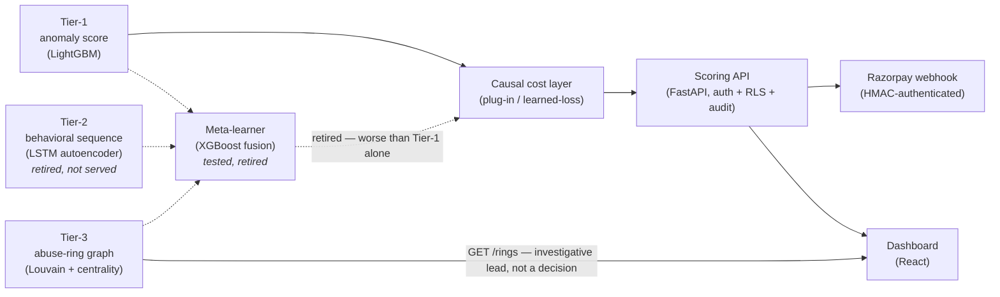

# RiskIQ

**Real-time fraud, chargeback and abuse-ring detection.**
Razorpay AI Buildathon 2026 — Track 2: AI Risk Manager.

RiskIQ scores a payment transaction in real time, ranks it by *cost* rather than raw
fraud probability, and surfaces the account rings behind coordinated abuse — with every
decision written to an append-only audit trail an analyst can open and see the reasoning
for. It is built as four independent layers rather than one classifier, on the belief
that a fraud system a panel (or a merchant) cannot audit is not one they should trust:
a per-transaction anomaly score, a causal cost layer that turns that score into a
block/allow decision, and a transaction-network graph that finds abuse rings a
per-transaction model structurally cannot see. Two more layers — a behavioral sequence
model and a meta-learner fusing everything — were built, measured, and **retired**
because the held-out numbers said they added nothing; that result is reported here
rather than hidden, because a fraud product's honesty about what does *not* work is
part of what makes the part that does work believable.

## Headline numbers

Every figure below is measured on a time-ordered held-out test split — never on live
demo traffic — and ships with its 95% CI and its false-positive cost. Full detail,
confusion matrices, and the obstacles behind each number are in `BUILD_LOG.md`.

| Layer | Result | Status |
|---|---|---|
| **Tier-1** (LightGBM, per-transaction) | PR-AUC **0.5276**, 95% CI [0.5117, 0.5462], vs 0.0348 no-skill floor — **15.2x lift** | Shipped, carries the scoring path |
| **Tier-3** (Louvain, abuse-ring graph) | Ring-level PR-AUC **0.6465**, 95% CI [0.5700, 0.7171], vs 0.1077 base rate — **6.0x lift** on 1,328 test rings | Shipped as an investigative lead (`GET /rings`) — **provisional**: a confirmed determinism gap means three same-seed reruns produced different ring counts and a validation-PR-AUC swing; treat 0.6465 as pending a fix, not final |
| **Meta-learner** (XGBoost fusion, Tier-1 + Tier-2 + Tier-3) | PR-AUC **0.4954** vs Tier-1 alone's 0.5276 — paired delta **-0.0322**, CI excludes zero **on the negative side** | Tested, **retired** — measurably worse on the ranking metric than Tier-1 alone; its cost-side advantage (~1.7% cheaper) was a bare point estimate with no CI, not enough to ship on |
| **Cost-aware ranking** (Phase 6, shipped policy) | **-22.41%** cost per 1,000 decisions vs probability-only ranking at a matched 1% flag rate, CI [-1345.28, -881.81] (card-present cost model, $3 review / $15 chargeback) | Shipped — **regime-dependent**: under a card-not-present cost model ($50 / $500) the same policy's advantage falls to **-2.22%**, CI [-582.18, -145.50] — still real, an order of magnitude smaller. A second policy that *trains* on cost rather than just *thresholding* by it (`learned_loss`) reached -19.79% and tied with the shipped policy (CI crosses zero) — cost-sensitive training bought nothing over cost-sensitive thresholding here |

The one sentence that explains the cost result: **cost-aware ranking pays in proportion
to how heterogeneous the loss is.** At a flat $500 chargeback fee, every miss costs
about the same and there is little for a cost model to exploit; at $15, transaction
amount varies the loss enough for cost-aware ranking to matter.

## Architecture



Solid arrows are the live decision path; dashed arrows are layers that were built,
measured, and did not make the cut. Tier-3 stands apart from the scoring path entirely
— it never moves a score, and its ring topology is surfaced to analysts directly.

## Quick start

```bash
cp backend/.env.example backend/.env    # then fill in the placeholders
docker compose up
```

| Service  | URL                            |
|----------|--------------------------------|
| Backend  | http://localhost:8000          |
| API docs | http://localhost:8000/docs     |
| Health   | http://localhost:8000/health   |
| Frontend | http://localhost:5173          |
| Postgres | `localhost:5432`               |
| Redis    | `localhost:6379`               |

## API

Every route requires server-side authentication and permissions come from that authentication,
never from anything in the request — but not every route uses the same mechanism. Most take a
bearer token, scoped by the `scopes` claim; `/health` needs none by design; the webhook is
authenticated by an HMAC signature instead, because it has no caller to issue it a token to.
Full schemas at `/docs`.

| Method | Path | Auth | Returns |
|--------|------|------|---------|
| `GET`  | `/health` | none | Liveness. Checks no dependency by design. |
| `POST` | `/score` | bearer, `score:write` | The decision, and an audit handle. |
| `GET`  | `/transactions` | bearer, `transactions:read` | The caller's scored transactions. |
| `GET`  | `/audit` | bearer, `audit:read` | Recent recorded decisions visible to the caller. |
| `GET`  | `/audit/{transaction_id}` | bearer, `audit:read` | Every recorded decision for one transaction. |
| `GET`  | `/audit/entry/{audit_id}/explain` | bearer, `explain:read` + `analyst` | Feature attribution. Analysts only. |
| `GET`  | `/rings` | bearer, `rings:read` + `analyst` | Flagged abuse rings and their membership. |
| `POST` | `/auth/ws-ticket` | bearer, `analyst` + `audit:read` + `explain:read` | A short-lived ticket for the live feed socket. |
| `GET`  | `/ws/feed` | ws-ticket (query param) | The live scoring decision feed, analyst-only. |
| `POST` | `/webhooks/razorpay/transaction` | HMAC (`X-Razorpay-Signature`), not a bearer token | Score a Razorpay payment event; returns risk context — see `BUILD_LOG.md`'s Phase 9 entry for why this one route's response is allowed to carry more than the others. |
| `POST` | `/auth/demo-token` | none — mints a token rather than requiring one | Local/CI only; not mounted in staging or production. |

`POST /score` takes **raw transaction fields**, never an engineered feature vector. The server
assembles the vector from the payload, the account's own history, and the fitted encoders — an
endpoint accepting a caller-supplied vector would let that caller choose its own score. The 22
derived features are rejected by name if supplied.

### What `/score` deliberately does not return

The response carries the decision and an opaque `audit_id`, and nothing else quantitative. No
calibrated probability, no operating threshold, no expected-cost arms, no feature attribution
— and no coarse risk band either. Each of those, combined with the amount, lets a caller
binary-search the largest transaction that evades review at a given risk score, and coarsening
a monotone score into bands does not prevent that search, it only slows it by a constant.

All of it is recorded in the audit row. Attribution is served to analysts at
`/audit/entry/{id}/explain`; the cost arms are served nowhere, because the sign of the expected
saving from blocking *is* the decision boundary.

The decision itself is the irreducible disclosure — a scoring API has to tell the caller what
happened to the transaction. That residual is bounded by authentication and the rate limiter.

### Getting a token

There is no signup flow — tokens are minted server-side by
`app.core.security.create_access_token`. For a local demo:

```bash
cd backend && python -c "
from app.config import get_settings
from app.core.security import create_access_token
print(create_access_token('demo-merchant', account_id='acct-1',
                          scopes=('score:write',), settings=get_settings()))
"
```

### Before the first score

`/score` returns 503 until it can load its models, and models are gitignored build outputs.
The serving encoders are rebuilt from the processed parquet once per corpus:

```bash
cd backend && python -m app.data.serving_encoders --source-dataset ieee_cis
```

## Local development without Docker

```bash
# Backend
cd backend && pip install -r requirements.txt
uvicorn app.main:app --reload

# Frontend
cd frontend && npm install && npm run dev
```

## Checks

```bash
cd backend  && ruff check . --fix && mypy app/ && pytest -x
cd frontend && npm run lint && npm test

pre-commit install          # once per clone
pre-commit run --all-files
```

## Layout

| Path | What it holds |
|------|---------------|
| `backend/app/models/` | One file per DB table and one per architecture layer — never merged |
| `backend/app/core/audit.py` | The audit-trail choke point every scoring decision passes through |
| `models/registry.json` | Append-only record of every trained model version |
| `PHASE_PROMPTS.md` | The full phase-by-phase build plan |
| `BUILD_LOG.md` | What shipped, what is deferred, known gaps |
| `.claude/skills/` | The security and ML-evaluation bars this project is held to |

## Future work

Not built — named honestly as known follow-ups, not hidden gaps, from the Phase 9.5
audit's feature-opportunity catalog. Full detail in `BUILD_LOG.md`'s Phase 9 and 9.5
entries.

- **`scored_transactions` ledger** and **`(account_id, transaction_id)` idempotency** on
  `POST /score` and the webhook — both named a Phase 7 prerequisite, still open
- **Real identity binding** for the webhook's `notes["riskiq_account_id"]` claim — the
  current known-account gate narrows but does not close the exposure
- **Request-id logging** across the API
- **A CI secret scan over the full git history** (`git log -p` / trufflehog) — never
  independently re-verified by an agent with shell access
- **Tier-3 determinism fix** — extend the cross-process reproducibility guard (currently
  PaySim-only) to the IEEE-CIS path, to make the 0.6465 headline final rather than
  provisional
- **PaySim surrogate-ring-recovery threshold fix** — currently selected on the test
  split rather than validation

## Scope

Strictly defense-only. Nothing here may be used to generate, automate or evade fraud —
that is a track disqualification rule, and it is enforced in
`.claude/skills/security-checklist/SKILL.md` section 8.
