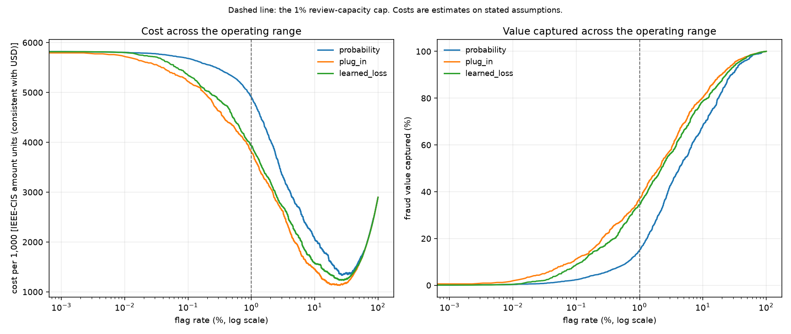

# Phase 6 — Causal Cost Layer

Random seed 42. Model `causal-cost-dr-plugin-ieee-cis-20260825t045935z`, consuming Tier-1 `tier1-anomaly-lightgbm-ieee-cis-20260822t185154z` (feature version `fv_c1d8eb96f693`).

## There is no treatment variable in this data

The phase brief asks for inverse probability weighting on the historical actions. **Neither corpus records an action.** IEEE-CIS carries 394 transaction columns and 41 identity columns; not one is a decision, decline, review or dispute, and `M1`-`M9` are Vesta address-match flags rather than review outcomes. PaySim carries one action-like column, `isFlaggedFraud`, and it fails three ways at once: it is the simulator's own hardcoded rule, so its propensity is exactly 0 or 1 and `1/e(x)` is undefined; it is nested inside the label, so the treated arm has no control counterfactual; and it fires on 16 rows out of 6.36 million. The pipeline already drops it as a leaked downstream decision.

Every transaction in this project's data was allowed. **No causal effect is recovered here and none is claimed.**

### What follows from that, proved rather than asserted

Under the stated cost model both potential outcomes are deterministic given the label and the amount:

```
cost(block | Y) = (1 - Y) * r          a review is paid only when the row was legitimate
cost(allow | Y) = Y * (A + f)          a missed fraud loses the amount, plus the fee

E[cost(block) | x] = (1 - p(x)) * r
E[cost(allow) | x] = p(x) * (A + f)

tau(x) = (1 - p(x)) * r  -  p(x) * (A + f)
```

Every term is either known before the decision or is `p(x)`. There is no residual confounding for a doubly robust correction to remove, because there is no treatment whose assignment could be confounded. **The DR-Learner does not fail here — it collapses, exactly, onto a cost-weighted plug-in rule.** Two things follow, and this phase builds both.

**The decision threshold stops being global.** Blocking pays when `p(x) > r / (A + f + r)`, a cut-off that moves with the amount. Break-even probability is per-transaction, not global: p > r/(A+f+r). Across the test split it spans 0.000557 to 0.162171 (median 0.034682). That spread is what cost-aware ranking exploits and a single global threshold cannot.

**There is still something to learn.** The plug-in reaches expected loss through `p(x) * (A + f)`, a classifier fitted over counts. The `learned_loss` policy regresses the realised loss directly, weighting large frauds during fitting rather than only at decision time. Whether that helps is measured below, not assumed.

## Held-out test

All three policies rank the same calibrated Tier-1 probability and are held to the same 1% review-capacity cap, chosen on V-late. Test was scored once, after every operating point was fixed, and selects nothing.

**Two operating points appear in this report and they are not the same number.** The blocks below are the *shipped* point: a threshold chosen on V-late and transferred to test unchanged, which is the honest measurement because nothing on test was used to pick it. Its realised flag rate is therefore near 1% but not exactly it, because test's score distribution is not V-late's. The table that follows matches all three policies to the same flag rate *as a quantile of the test scores*, which is what makes their precision figures comparable with each other — and is why that table selects nothing and is reported only after the shipped thresholds were fixed. Confusion matrix and cost block within any one result are always the same cut.

```
### cost-policy:probability — held-out test (n=88,581, positives=3,083, base rate=3.4804%)
Threshold: 0.7090647381510433  (flagging at most 1.0% of V-late validation traffic, transferred to test unchanged)

PR-AUC     0.5276  (95% CI 0.5117-0.5462)
           no-skill floor 0.0348 (15.2x lift)
Precision  0.8080      Recall  0.3153      F1  0.4536

Confusion matrix        Predicted
                     neg        pos
Actual  neg     85,267        231
        pos      2,111        972

False-positive cost estimate: 4,553.47 per 1,000 transactions  [IEEE-CIS amount units (consistent with USD)]
  231 false positives x 3.00 = 693.00
  2,111 false negatives (amount + 15.00) = 402,657.98
  total = 403,350.98 over 88,581 transactions
  flag rate = 1.36% (1,203 sent for review)
  Assumptions:
    - A false positive costs 3.00 IEEE-CIS amount units (consistent with USD) - analyst time on a manual review, or the lost margin and friction of declining a good customer.
    - A false negative costs the transaction amount plus a flat 15.00 - the chargeback fee and internal handling on top of the value lost.
    - Cost is linear in the number of mistakes: no queue-congestion effect, no customer-churn effect from repeated false declines, no recovery on disputed fraud. All three would raise the true cost of a false positive.
    - Every fraud is assumed to charge back. In practice some share is never disputed, which would lower false-negative cost.
    - Review capacity is unbounded. This is the assumption that bites hardest: the cost-minimising threshold below flags whatever share of traffic the arithmetic favours, with no ceiling on the queue it implies.
```

```
### cost-policy:plug_in — held-out test (n=88,581, positives=3,083, base rate=3.4804%)
Threshold: 90.85343882831513  (flagging at most 1.0% of V-late validation traffic, transferred to test unchanged)

PR-AUC     0.3194  (95% CI 0.3047-0.3364)
           no-skill floor 0.0348 (9.2x lift)
Precision  0.4840      Recall  0.1573      F1  0.2375

Confusion matrix        Predicted
                     neg        pos
Actual  neg     84,981        517
        pos      2,598        485

False-positive cost estimate: 3,654.63 per 1,000 transactions  [IEEE-CIS amount units (consistent with USD)]
  517 false positives x 3.00 = 1,551.00
  2,598 false negatives (amount + 15.00) = 322,179.58
  total = 323,730.58 over 88,581 transactions
  flag rate = 1.13% (1,002 sent for review)
  Assumptions:
    - A false positive costs 3.00 IEEE-CIS amount units (consistent with USD) - analyst time on a manual review, or the lost margin and friction of declining a good customer.
    - A false negative costs the transaction amount plus a flat 15.00 - the chargeback fee and internal handling on top of the value lost.
    - Cost is linear in the number of mistakes: no queue-congestion effect, no customer-churn effect from repeated false declines, no recovery on disputed fraud. All three would raise the true cost of a false positive.
    - Every fraud is assumed to charge back. In practice some share is never disputed, which would lower false-negative cost.
    - Review capacity is unbounded. This is the assumption that bites hardest: the cost-minimising threshold below flags whatever share of traffic the arithmetic favours, with no ceiling on the queue it implies.

PR-AUC here ranks by expected cost, not by probability. It is reported for continuity with Phases 2-5 and is NOT this phase's headline -- a cost-ranked policy is not trying to win a count-based metric, and losing one is the expected consequence of ranking by value instead.
```

```
### cost-policy:learned_loss — held-out test (n=88,581, positives=3,083, base rate=3.4804%)
Threshold: 56.52708851996744  (flagging at most 1.0% of V-late validation traffic, transferred to test unchanged)

PR-AUC     0.2924  (95% CI 0.2767-0.3088)
           no-skill floor 0.0348 (8.4x lift)
Precision  0.4935      Recall  0.1729      F1  0.2561

Confusion matrix        Predicted
                     neg        pos
Actual  neg     84,951        547
        pos      2,550        533

False-positive cost estimate: 3,724.46 per 1,000 transactions  [IEEE-CIS amount units (consistent with USD)]
  547 false positives x 3.00 = 1,641.00
  2,550 false negatives (amount + 15.00) = 328,275.46
  total = 329,916.46 over 88,581 transactions
  flag rate = 1.22% (1,080 sent for review)
  Assumptions:
    - A false positive costs 3.00 IEEE-CIS amount units (consistent with USD) - analyst time on a manual review, or the lost margin and friction of declining a good customer.
    - A false negative costs the transaction amount plus a flat 15.00 - the chargeback fee and internal handling on top of the value lost.
    - Cost is linear in the number of mistakes: no queue-congestion effect, no customer-churn effect from repeated false declines, no recovery on disputed fraud. All three would raise the true cost of a false positive.
    - Every fraud is assumed to charge back. In practice some share is never disputed, which would lower false-negative cost.
    - Review capacity is unbounded. This is the assumption that bites hardest: the cost-minimising threshold below flags whatever share of traffic the arithmetic favours, with no ceiling on the queue it implies.

PR-AUC here ranks by expected cost, not by probability. It is reported for continuity with Phases 2-5 and is NOT this phase's headline -- a cost-ranked policy is not trying to win a count-based metric, and losing one is the expected consequence of ranking by value instead.
```

### All three at a matched 1% flag rate

| policy | threshold | flag rate | precision | recall (count) | recall (value) | TN | FP | FN | TP | cost / 1,000 |
| --- | ---: | ---: | ---: | ---: | ---: | ---: | ---: | ---: | ---: | ---: |
| `probability` | 0.8517166781525443 | 1.000% | 0.8646 | 0.2485 | **15.00%** | 85,378 | 120 | 2,317 | 766 | 4,902.49 |
| `plug_in` | 99.98794967846524 | 1.000% | 0.4955 | 0.1424 | **36.98%** | 85,051 | 447 | 2,644 | 439 | 3,804.02 |
| `learned_loss` | 64.62632029620828 | 1.000% | 0.5056 | 0.1453 | **34.53%** | 85,060 | 438 | 2,635 | 448 | 3,932.14 |

### The headline: paired intervals on the cost difference

Pre-registered before test was read: **if the interval straddles zero, the comparison is a tie**, however far apart the point estimates look. Negative cost delta means cheaper than the named baseline.

Two questions, three rows. The first two ask whether cost-aware ranking beats probability ranking at all. The third asks the question BUILD_LOG actually handed this phase — whether cost-sensitive *training* buys anything over cost-sensitive *thresholding* — and it is measured directly rather than inferred from the first two. Two intervals that share a baseline and overlap say nothing about how the candidates compare with each other, so `learned_loss` is paired against `plug_in` on its own.

| comparison | cost delta / 1,000 | 95% CI | value recall delta | 95% CI | verdict |
| --- | ---: | ---: | ---: | ---: | --- |
| `plug_in` vs `probability` | -1,098.48 (-22.41%) | [-1,345.28, -881.81] | +21.97pp | [+18.32, +25.53] | CHEAPER than the baseline |
| `learned_loss` vs `probability` | -970.35 (-19.79%) | [-1,189.92, -769.45] | +19.52pp | [+16.30, +22.82] | CHEAPER than the baseline |
| `learned_loss` vs `plug_in` | +128.13 (+3.37%) | [-30.41, +300.03] | -2.45pp | [-5.55, +0.47] | TIE -- the interval on the cost difference includes zero |

The bootstrap is stratified and paired: both policies are scored on the same resample, and the threshold is re-derived inside each one rather than held at the value the full sample produced. Because the resample holds the fraud count fixed, the interval describes uncertainty in *which* frauds and therefore in their amounts — and cost on this corpus is dominated by a handful of large transactions, so the intervals are wide. That width is the finding, not a defect in the estimator.

## Cost across the full operating range



Computed on the **held-out test split** (n=88,581). Left: cost per 1,000 against flag rate. Right: share of fraud *value* captured. The dashed line is the 1% capacity cap. The two panels are the whole argument of this phase — policies that rank identically on count can separate on value.

## Cost-optimal operating points

Each policy's unconstrained cost minimum, chosen on V-late and applied to test. Reported beside the capacity-capped points rather than instead of them: the unconstrained optimum flags more traffic than any review queue could absorb, which is the assumption the cost model calls the one that bites hardest.

| policy | threshold | flag rate | cost / 1,000 | vs capped |
| --- | ---: | ---: | ---: | ---: |
| `probability` | 0.0179188130382405 | 24.010% | 1,398.19 | -3,504.30 |
| `plug_in` | -0.579557518294842 | 23.138% | 1,135.79 | -2,668.23 |
| `learned_loss` | -0.21613213828903755 | 22.605% | 1,266.75 | -2,665.39 |

## Sensitivity — how much of this rests on the guessed constants

```
Cost sensitivity, both parameters scaled together [V-LATE VALIDATION SLICE, n=22,146 -- not test]
  factor   threshold        total cost        FP        FN   flag rate
    0.5x      0.591551         13,267.52     4,468       115     22.73%
    1.0x     -0.579558         20,622.97     4,322       116     22.06%
    1.5x     -1.506627         27,640.32     3,966       127     20.41%
```

```
Review cost sensitivity, false-positive cost alone [V-LATE VALIDATION SLICE, n=22,146 -- not test]
  factor   threshold        total cost        FP        FN   flag rate
    1.0x     -0.579558         20,622.97     4,322       116     22.06%
    5.0x      3.131588         47,132.13       864       312      5.56%
   25.0x     34.011474         69,307.64       145       489      1.52%
  100.0x     48.177371         78,150.24        23       551      0.69%
```

### The card-not-present regime

Published CNP figures price a false positive far above analyst time. Re-derived end to end at review cost 50 and chargeback fee 500, rather than rescaled. **This table selects nothing** — the project default (review 3.00, fee 15.00) remains the basis for every headline above, so that these numbers stay comparable with Phases 2-5.

| policy | flag rate | recall (value) | cost / 1,000 |
| --- | ---: | ---: | ---: |
| `probability` | 1.000% | 15.00% | 17,652.23 |
| `plug_in` | 1.000% | 26.86% | 17,259.74 |
| `learned_loss` | 1.000% | 20.94% | 17,368.31 |

| comparison (CNP regime) | cost delta / 1,000 | 95% CI | verdict |
| --- | ---: | ---: | --- |
| `plug_in` vs `probability` | -392.49 (-2.22%) | [-582.18, -145.50] | CHEAPER than the baseline |
| `learned_loss` vs `probability` | -283.92 (-1.61%) | [-432.69, -97.73] | CHEAPER than the baseline |

**This is the most important caveat on the headline, and it is not a small one.** Cost-aware ranking saves 22.4% under the project cost model. Under the card-not-present one the point estimate is 2.2% and **the interval is the verdict above** — the same pre-registered tie rule that governs the headline governs the number that qualifies it, because applying it only to the figure that flatters the phase would be selective. The mechanism is arithmetic, not noise. A false negative costs `amount + fee`, so the *share of that cost which varies between transactions* is what value-weighting has to work with. At the default fee of 15.00 against a median test amount of 68.50, that varying share is 82.0%. At the card-not-present fee of 500.00 it falls to 12.0% — the flat fee dominates, every miss costs roughly the same, and ranking by expected cost collapses back towards ranking by probability.

So the honest statement of this phase's result is conditional: **cost-aware ranking pays in proportion to how much of the loss varies across transactions.** Where a missed fraud costs mostly the transaction value, the gain is large. Where it costs mostly a fixed dispute-handling fee, there is little to exploit and the extra machinery is not worth its complexity. Which regime a given payments business is in is an empirical question about its own chargeback economics, not something this corpus can answer.

## Off-policy evaluation: validating the estimator, not measuring an effect

There is no logged policy to reweight, so one is **simulated** with a propensity known by construction. That is what makes this section worth running: because both potential outcomes are deterministic given the label and the amount, the true cost of each policy is *computable exactly*, and the estimators can be scored against it rather than trusted. A deployment with real logged decisions needs exactly this machinery; here it can be checked.

One thing to read carefully. The propensity here is **known exactly**, because this module wrote it. Under a correct propensity IPW is unbiased by construction, so it is not a surprise or an achievement when it lands close to the truth — and the doubly robust estimator, whose correction term adds variance it does not need in that setting, can legitimately land further away. What this section establishes is that the estimators are implemented correctly and recover a known answer. It cannot establish which would win where the propensity has to be estimated, which is the case that actually matters in deployment and is not testable on data with no logged actions at all.

```
Off-policy evaluation of: cost-policy:probability at 1% flag rate  (n=88,581)
  true cost per unit         4.9025   (exact, computed from labels)
  direct method              4.7847   bias   -2.40%
  IPW                        5.1584   bias   +5.22%
  doubly robust              4.9617   bias   +1.21%
  logging policy: Simulated stochastic reviewer: P(block) = 0.05 + 0.55 * sigmoid(4.0 * (score - mean score)), seed 42. SIMULATED, not recovered from data -- neither corpus records a historical action. Its only purpose is to give the estimators below a policy whose propensity is known, so their answers can be checked against exact truth.
```

```
Off-policy evaluation of: cost-policy:plug_in at 1% flag rate  (n=88,581)
  true cost per unit         3.8040   (exact, computed from labels)
  direct method              3.4746   bias   -8.66%
  IPW                        3.8875   bias   +2.19%
  doubly robust              3.8552   bias   +1.35%
  logging policy: Simulated stochastic reviewer: P(block) = 0.05 + 0.55 * sigmoid(4.0 * (score - mean score)), seed 42. SIMULATED, not recovered from data -- neither corpus records a historical action. Its only purpose is to give the estimators below a policy whose propensity is known, so their answers can be checked against exact truth.
```

```
Off-policy evaluation of: cost-policy:learned_loss at 1% flag rate  (n=88,581)
  true cost per unit         3.9321   (exact, computed from labels)
  direct method              3.8713   bias   -1.55%
  IPW                        4.0152   bias   +2.11%
  doubly robust              3.9884   bias   +1.43%
  logging policy: Simulated stochastic reviewer: P(block) = 0.05 + 0.55 * sigmoid(4.0 * (score - mean score)), seed 42. SIMULATED, not recovered from data -- neither corpus records a historical action. Its only purpose is to give the estimators below a policy whose propensity is known, so their answers can be checked against exact truth.
```

## Calibration

Expected calibration error 0.005725, Brier score 0.022601. Every cost figure in this report is a probability multiplied by an amount, so calibration error propagates straight into cost — a 10% overstatement of `p` overstates every expected loss by 10% and moves every break-even threshold with it. The calibrator was fitted on V-fit; thresholds were chosen on V-late; this measurement is on test.

## Audit: the costliest mistakes

Required by ml-evaluation-standards section 4 — the failure modes below are read off actual false negatives, not imagined.

### Five costliest false negatives (fraud that got through)

| amount | p(fraud) | product | new device | new address | prior txns |
| ---: | ---: | --- | --- | --- | ---: |
| 3,076.97 | 0.010752 | W | False | False | 2 |
| 2,259.95 | 0.022642 | W | False | False | 2 |
| 1,949.69 | 0.026837 | W | True | True | 0 |
| 1,601.00 | 0.009644 | W | True | True | 0 |
| 1,504.47 | 0.004109 | W | False | False | 12 |

### Five costliest false positives (legitimate customers declined)

| amount | p(fraud) | product | new device | new address | prior txns |
| ---: | ---: | --- | --- | --- | ---: |
| 5,277.95 | 0.025563 | W | True | True | 0 |
| 4,652.92 | 0.031510 | W | True | True | 0 |
| 4,545.36 | 0.035647 | W | False | False | 2 |
| 4,011.95 | 0.076315 | W | True | False | 1 |
| 4,006.79 | 0.033577 | W | True | True | 0 |

## Validation, cut three ways

| slice | rows | positives | base rate | window |
| --- | ---: | ---: | ---: | --- |
| V-fit | 35,432 | 1,231 | 3.4743% | 2018-03-31 19:26:43+00:00 → 2018-04-12 12:31:11+00:00 |
| V-arb | 31,003 | 1,131 | 3.6480% | 2018-04-12 12:31:34+00:00 → 2018-04-24 02:31:07+00:00 |
| V-late | 22,146 | 680 | 3.0705% | 2018-04-24 02:31:25+00:00 → 2018-05-02 05:17:20+00:00 |

## What this layer does NOT do

- **It does not recover a causal effect.** There is no treatment variable in this data. The off-policy section validates estimators against a simulated policy; it measures nothing about what a real reviewer would have done.
- **It does not know the true cost of a false positive.** The review cost is a stated assumption, and the sensitivity tables above exist because the recommendation moves with it.
- **It does not improve detection.** Every policy reads the same Tier-1 probability. Cost-aware ranking changes which of the flagged transactions are worth the queue slot; it cannot find fraud Tier-1 did not score highly in the first place.
- **Its advantage shrinks when the chargeback fee dominates the amount.** The gain comes entirely from heterogeneity in what a miss costs. Price a false negative as a large flat fee plus a small amount and there is almost nothing left to exploit; the card-not-present table above shows exactly that.
- **It assumes review capacity is a hard cap and cost is linear in mistakes.** No queue-congestion effect, no customer-churn effect from repeated false declines, and no recovery on disputed fraud. All three would raise the true cost of a false positive.
- **It prices `review` and `block` identically.** Both put a transaction in front of a human and neither lets it complete, but a hard decline damages a customer relationship in a way a review does not, and this model cannot see the difference.

## Limitations

- NO TREATMENT VARIABLE EXISTS IN THIS DATA. IEEE-CIS records no action, decision, decline, review or dispute column; PaySim's isFlaggedFraud is a deterministic simulator rule firing on 16 of 6.36M rows, nested inside the label, and the pipeline drops it. Every transaction here was allowed. No causal effect is recovered from this corpus and none is claimed.
- Under the stated cost model both potential outcomes are deterministic given (label, amount), so the DR-Learner collapses exactly onto a cost-weighted plug-in rule driven by a calibrated probability. The proof is in the app.models.causal_cost module docstring. The DR machinery is used for off-policy EVALUATION against a SIMULATED logging policy, where the true policy cost is exactly computable and the estimators can therefore be validated rather than merely applied.
- Break-even probability is per-transaction, not global: p > r/(A+f+r). Across the test split it spans 0.000557 to 0.162171 (median 0.034682). That spread is what cost-aware ranking exploits and a single global threshold cannot.
- Loss regression: LightGBM Tweedie (variance power 1.5) on the target Y*(amount+15.00), the same feature set as Tier-1 (113 columns). Out-of-fold over 5 forward-chaining blocks; block 1 unscored, 330,703 of 413,378 train rows carry an out-of-fold prediction.
- Amount reaches every model in this phase as the engineered amount_log, which is a live Tier-1 feature. The raw amount and TransactionAmt columns are on the deny list only because they are exact duplicates of it, monotone and therefore giving a tree identical splits -- not because amount is withheld. This is not leakage: the amount is known before the decision is made, which is what makes it usable in the cost arithmetic at all. The loss regression reads exactly the columns Tier-1 reads and adds nothing.
- The per-transaction worked examples behind the 'what this does NOT catch' section are deliberately NOT recorded here. This file is tracked in git, and ten identified transactions with their exact fraud probabilities and the features that produced them is a worked set of examples of what does and does not clear the operating threshold. The aggregate failure modes are described in notebooks/cost_report.md and app/models/README.md, which is what ml-evaluation-standards section 4 requires; the identifiers add attacker value and are required by nothing.
- THE HEADLINE IS REGIME-DEPENDENT. A false negative costs amount + fee, so what value-weighting exploits is the share of that cost which varies between transactions: 82.0% at the default fee of 15.00 against a median test amount of 68.50, but only 12.0% at the card-not-present fee of 500.00. Under that regime the advantage largely disappears, as the cnp_regime block records. Cost-aware ranking pays in proportion to how heterogeneous the loss is, and that is a property of a business's chargeback economics rather than of this model.
- Test was scored once, after all operating points were fixed on V-late. The cost matrix is the project default (review 3.00, fee 15.00) so these figures are comparable with Phases 2-5; the card-not-present regime (50/500) is reported as a separate table and selects nothing.
