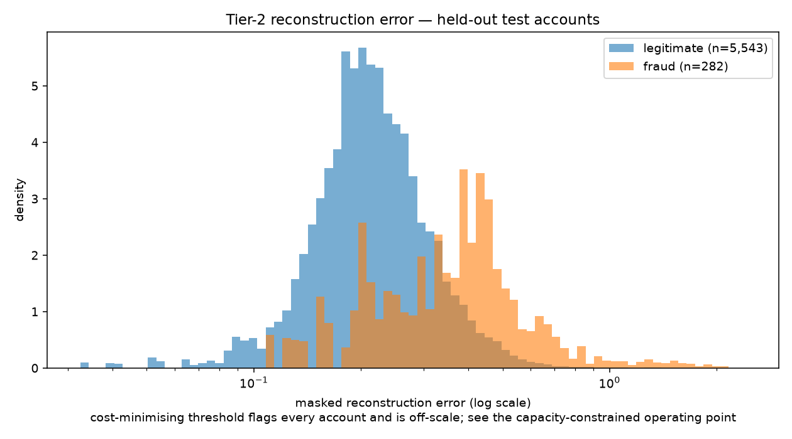
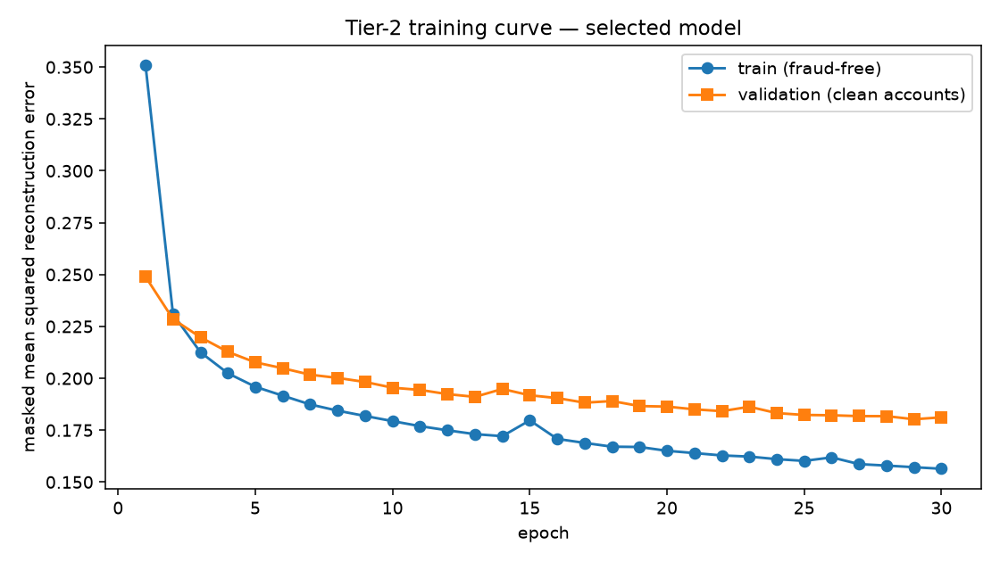

# RiskIQ — Phase 3 Tier-2 Evaluation

Generated by `python -m app.models.train_tier2`. Every headline number is measured on the held-out **test** split, **per account**, which was scored exactly once after the operating threshold, the latent size, the window and the abstention threshold had all been chosen on validation.

Random seed: `42`. Device: CPU (cuDNN's LSTM kernel is non-deterministic). Latency budget: p95 < 50ms.

## Why IEEE-CIS only

Phase 1 measured PaySim at 2,768,630 accounts of which 99.9% hold a single transaction, a maximum of 3, and `seconds_since_prior_txn` 99.94% null. A sequence model needs sequences. Running it there would produce a number, and the number would describe the simulator rather than any behaviour — the same trap Phase 2 documented for PaySim's Tier-1 result.

## Why the headline is per account, not per transaction

IEEE-CIS propagates a chargeback label across an account's later transactions. One compromised account holding 300 rows therefore contributes 300 correlated positives, and a per-transaction PR-AUC counts them as 300 independent correct calls when the model made one. The bootstrap has the same problem in reverse: resampling rows as though they were independent produces an interval far tighter than the evidence supports. At the account level the resampling unit genuinely is independent.

A straddling account appears as separate account-split units rather than carrying one global label, so its test outcome cannot describe its validation rows.

## Tier-2 input definition

- **source_dataset**: `ieee_cis`
- **tier2_feature_version**: `fv_da07bc36e0da`
- **window (W)**: 15 transactions, trailing, anchored at the transaction being scored
- **minimum length (N)**: 10 — shorter histories abstain rather than score
- **per-timestep features**: 21 (`amount_log`, `amount_zscore`, `log_seconds_since_prior`, `hour_sin`, `hour_cos`, `day_sin`, `day_cos`, `velocity_count_1h`, `velocity_count_24h`, `log_velocity_sum_24h`, `device_is_new`, `device_mismatch`, `addr_is_new`, `addr_mismatch`, `log_account_prior_txn_count`, `freq_ProductCD`, `freq_card4`, `freq_card6`, `freq_P_emaildomain`, `has_prior`, `has_zscore`)
- **scaling**: standardised on fraud-free train timesteps, clipped to +/-5 sd

Rows: train 413,378, val 88,581, test 88,581.

### Windows reaching into an earlier split

A window is built from the account's real history and assigned to its **anchor's** split, so a test window may contain train-period transactions. That is what a live scorer has in front of it; refusing to look would fabricate a serving condition that does not exist. The reach is one-directional and asserted against the timestamps, not merely intended:

| split | windows reaching back into an earlier split |
|---|---|
| train | 0 |
| val | 43,007 |
| test | 40,366 |

## Coverage — what Tier-2 can score at all

Not a footnote. Phase 1 measured 57.7% of IEEE-CIS accounts holding a single transaction, so a large share of traffic has no behavioural baseline and Tier-2 **abstains** on it rather than returning a zero. The fraud figure is the decisive one: a layer that can only score the transactions nobody was worried about has not earned its place.

| unit | scoreable | total | coverage |
|---|---|---|---|
| test accounts | 5,825 | 43,530 | 13.4% |
| test transactions | 25,518 | 88,581 | 28.8% |
| test fraud transactions | 1,514 | 3,083 | 49.1% |

### Coverage by split

Reported for all three splits, not test alone: an abstention rate that drifted along the timeline would mean the chosen N describes the validation period rather than a stable property of the corpus — and the operating threshold was chosen under that same N.

| split | accounts scored | account coverage | row coverage | fraud coverage |
|---|---|---|---|---|
| train | 5,506 / 155,946 | 3.5% | 17.0% | 40.3% |
| val | 5,271 / 44,803 | 11.8% | 26.3% | 49.0% |
| test | 5,825 / 43,530 | 13.4% | 28.8% | 49.1% |

### Is the abstention rule doing the ranking?

Abstained accounts sit at the bottom of the deployed ranking. If they are also less likely to be fraudulent, the system-level PR-AUC collects credit for a separation the autoencoder never produced — *we did not look* scoring as *we judged it safe*. The two base rates say how much of that is happening:

| account group | fraud base rate |
|---|---|
| Tier-2 abstained (ranked last) | 2.0979% |
| Tier-2 scored | 4.8412% |

The further apart these are, the more of the deployed number is the abstention policy rather than the model, and the more weight the scoreable-accounts-only block below carries as the measure of what the autoencoder actually learned.

## Candidate comparison — validation selects, test reports

**Selection reads the `val PR-AUC` column, never the test column.** Test is scored once, after the winner is already chosen, for reporting only — choosing on it would make it a validation set and invalidate the headline.

| candidate | val PR-AUC | test PR-AUC | 95% CI | lift | precision | recall | F1 |
|---|---|---|---|---|---|---|---|
| _no-skill floor (random ranker)_ | — | 0.0246 | — | 1.0x | — | — | — |
| amount-only account ranking (reference) | — | 0.0373 | 0.0346–0.0406 | 1.5x | 0.0312 | 0.7810 | 0.0600 |
| Tier-1, aggregated to account (baseline) | — | 0.5724 | 0.5429–0.6001 | 23.2x | 0.0755 | 0.8993 | 0.1394 |
| LSTM autoencoder (latent=8, W=10) | 0.0878 | 0.0872 | 0.0744–0.1039 | 3.5x | 0.0246 | 1.0000 | 0.0481 |
| LSTM autoencoder (latent=16, W=10) | 0.0742 | 0.0775 | 0.0672–0.0911 | 3.1x | 0.0246 | 1.0000 | 0.0481 |
| LSTM autoencoder (latent=32, W=10) | 0.0720 | 0.0738 | 0.0640–0.0872 | 3.0x | 0.0246 | 1.0000 | 0.0481 |
| LSTM autoencoder (latent=8, W=5) | 0.0754 | 0.0828 | 0.0712–0.0979 | 3.4x | 0.0246 | 1.0000 | 0.0481 |
| LSTM autoencoder (latent=8, W=15) **(selected)** | 0.1021 | 0.0952 | 0.0801–0.1154 | 3.9x | 0.0246 | 1.0000 | 0.0481 |
| LSTM autoencoder (latent=8, W=20) | 0.0888 | 0.0893 | 0.0769–0.1053 | 3.6x | 0.0246 | 1.0000 | 0.0481 |
| Dense autoencoder (latent=8, no recurrence) | 0.0799 | 0.0866 | 0.0747–0.1027 | 3.5x | 0.0246 | 1.0000 | 0.0481 |

### Does the bottleneck bite?

The phase's main architectural risk was an autoencoder wide enough to learn the identity map: it reconstructs fraud exactly as faithfully as normal behaviour and its two error distributions land on top of each other. Reconstruction loss alone cannot detect that — a wider latent always reconstructs *better*. Separation can:

| candidate | clean-val loss | median error, legit | median error, fraud | ratio |
|---|---|---|---|---|
| LSTM autoencoder (latent=8, W=10) | 0.17469 | 0.15928 | 0.24899 | 1.563x |
| LSTM autoencoder (latent=16, W=10) | 0.11254 | 0.09226 | 0.17272 | 1.872x |
| LSTM autoencoder (latent=32, W=10) | 0.05643 | 0.02834 | 0.08330 | 2.939x |
| LSTM autoencoder (latent=8, W=5) | 0.14295 | 0.13518 | 0.25399 | 1.879x |
| LSTM autoencoder (latent=8, W=15) | 0.18027 | 0.23744 | 0.43687 | 1.840x |
| LSTM autoencoder (latent=8, W=20) | 0.18160 | 0.15918 | 0.26374 | 1.657x |
| Dense autoencoder (latent=8, no recurrence) | 0.20759 | 0.18878 | 0.30394 | 1.610x |

A latent that reconstructs everything well shows a low loss and a ratio near 1.0 — faithful, and useless. The selected candidate is the one whose *ratio* is largest on validation, not the one whose loss is lowest, and the two do not agree.

### Does Tier-2 beat the layer that already ships?

PR-AUC delta against Tier-1 aggregated to account: **95% CI [-0.5110, -0.4527]**.

**Tier-2 loses this comparison.** On this test split it does not rank accounts better than Tier-1's existing per-transaction scores aggregated the same way. That is the finding, and it is not a surprising one: Tier-1 is supervised on the label and Tier-2 is one-class, so the head-to-head was always the wrong question to hang the layer on. The right one is below.

### What Tier-2 adds that Tier-1 does not

Tier-2 is not built to replace Tier-1 — Phase 5 **fuses** them. A weaker signal that is uncorrelated with a stronger one can still add ranking power to the pair while losing to it alone, so the question that decides whether this layer earned its place is whether it separates fraud **among the accounts Tier-1 has already decided are safe**.

- Spearman rank correlation between the two layers' account scores: **-0.0406**. Near zero means the layers are looking at different things, which is the precondition for fusion adding anything.
- Among the 43,094 test accounts Tier-1 leaves below its own capacity threshold — the accounts a Tier-1-only system does not review — 691 are fraudulent (1.60%).
- Tier-2 ranks that residual at PR-AUC **0.0242** against a floor of 0.0160 — **1.5x lift on the fraud Tier-1 would not have looked at.**

A 1.5x residual lift is **not** on its own evidence that the layer earns its place, and this report does not claim it is. What it establishes is narrower: the two signals are close to orthogonal, and Tier-2 ranks Tier-1's residual above chance. Whether that converts into anything is a question only the fused model can answer.

**The test Phase 5 should run**, stated here so it is not quietly skipped: fit the meta-learner with and without the Tier-2 feature, on validation, and keep the feature only if the paired PR-AUC delta excludes zero. If it does not, this layer is a negative result and should be written up as one rather than carried because it was built.

**Selection over the runner-up** (LSTM autoencoder (latent=8, W=20)): delta 95% CI [-0.0048, 0.0048]. **The interval includes zero**: on this test split the runner-up performs as well, and the selection rests on a point estimate inside the noise.

## Reconstruction-error distribution



```
Account reconstruction error by class (held-out test, scoreable accounts only):
                                       5%        25%        50%        75%        90%        95%        99%
                              -----------------------------------------------------------------------------
legitimate accounts          n=5,543       0.13795    0.19022    0.23744    0.30670    0.39567    0.47211    0.66033
fraudulent accounts          n=282         0.19924    0.33740    0.43687    0.59456    0.94551    1.35777    1.89557
```

### Is the score a sequence-length sensor?

Spearman rank correlation between reconstruction error and window length, on held-out test scoreable accounts: **+0.4484**.

Padding is right-aligned and every error divides by the count of real timesteps rather than by W; had it divided by W, a 3-step window in a 10-step slot would receive seven free perfectly-reconstructed steps and every short-history account would score as normal. `tests/test_tier2.py` pins that arithmetic in both directions, so a correlation here is **not** a masking bug — it is the architecture: regenerating more timesteps from one fixed latent vector is genuinely harder, so longer windows reconstruct worse. Since fraudulent accounts also tend to hold more transactions, part of the headline may be the model ranking accounts by history depth rather than by how unusual that history is.

Holding length roughly constant is what separates the two:

| window length | accounts | fraudulent | base rate | PR-AUC | lift |
|---|---|---|---|---|---|
| 3-4 transactions | 6,714 | 154 | 2.29% | 0.0360 | 1.6x |
| 5-9 transactions | 7,599 | 170 | 2.24% | 0.0425 | 1.9x |
| 10+ transactions | 5,825 | 282 | 4.84% | 0.2905 | 6.0x |

A band whose PR-AUC collapses to its own base rate (1.0x lift) is one where the layer has learned nothing about behaviour and was reading depth. A band that keeps its lift is evidence the sequence signal is real.

## Training curve



| epoch | train loss (fraud-free) | clean-validation loss |
|---|---|---|
| 1 | 0.350744 | 0.248958 |
| 2 | 0.230911 | 0.228546 |
| 3 | 0.212565 | 0.219790 |
| 4 | 0.202426 | 0.212735 |
| 5 | 0.195925 | 0.207692 |
| 6 | 0.191625 | 0.204849 |
| 7 | 0.187401 | 0.201741 |
| 8 | 0.184406 | 0.200192 |
| 9 | 0.181850 | 0.198240 |
| 10 | 0.179375 | 0.195468 |
| 11 | 0.176955 | 0.194411 |
| 12 | 0.174941 | 0.192381 |
| 13 | 0.173100 | 0.191065 |
| 14 | 0.172122 | 0.194864 |
| 15 | 0.179744 | 0.191824 |
| 16 | 0.170805 | 0.190481 |
| 17 | 0.168864 | 0.188251 |
| 18 | 0.167047 | 0.189044 |
| 19 | 0.166910 | 0.186624 |
| 20 | 0.165067 | 0.186369 |
| 21 | 0.163966 | 0.185054 |
| 22 | 0.162836 | 0.184173 |
| 23 | 0.162284 | 0.186299 |
| 24 | 0.161043 | 0.183237 |
| 25 | 0.160201 | 0.182347 |
| 26 | 0.161901 | 0.182191 |
| 27 | 0.158647 | 0.181779 |
| 28 | 0.157942 | 0.181764 |
| 29 | 0.157166 | 0.180270 |
| 30 | 0.156404 | 0.181202 |

Early stopping reads the clean-validation **reconstruction loss** — the autoencoder's own objective — not PR-AUC. Stopping on PR-AUC would tune the model against the metric it is judged by. Which candidate ships is a separate decision and reads validation PR-AUC.

## Abstention threshold N, swept on validation

N is a scoring-time policy, not a training one: the autoencoder fits on every eligible window of at least 3 transactions and N only decides which windows get an opinion. The sweep therefore costs no extra training and the weights are identical across it.

| N | validation account PR-AUC |
|---|---|
| 3 | 0.0890 |
| 5 | 0.0932 |
| 10 | 0.1021 | **(chosen)**

## Full results

### Deployed system — all test accounts, abstentions counted as never flagged

```
### LSTM autoencoder (latent=8, W=15) — held-out test (n=43,530, positives=1,073, base rate=2.4650%)
Threshold: -1.000000  (chosen on validation by minimising estimated cost on validation accounts)

PR-AUC     0.0952  (95% CI 0.0801-0.1154)
           no-skill floor 0.0246 (3.9x lift)
Precision  0.0246      Recall  1.0000      F1  0.0481

Confusion matrix        Predicted
                     neg        pos
Actual  neg          0     42,457
        pos          0      1,073

False-positive cost estimate: 2,926.05 per 1,000 transactions  [IEEE-CIS amount units (consistent with USD)]
  42,457 false positives x 3.00 = 127,371.00
  0 false negatives (amount + 15.00) = 0.00
  total = 127,371.00 over 43,530 transactions
  flag rate = 100.00% (43,530 sent for review)
  Assumptions:
    - A false positive costs 3.00 IEEE-CIS amount units (consistent with USD) - analyst time on a manual review, or the lost margin and friction of declining a good customer.
    - A false negative costs the transaction amount plus a flat 15.00 - the chargeback fee and internal handling on top of the value lost.
    - Cost is linear in the number of mistakes: no queue-congestion effect, no customer-churn effect from repeated false declines, no recovery on disputed fraud. All three would raise the true cost of a false positive.
    - Every fraud is assumed to charge back. In practice some share is never disputed, which would lower false-negative cost.
    - Review capacity is unbounded. This is the assumption that bites hardest: the cost-minimising threshold below flags whatever share of traffic the arithmetic favours, with no ceiling on the queue it implies.

All test accounts (n=43,530), with the 37,705 Tier-2 abstained on counted as never flagged. **This is the deployed system's number.** The model's own number, over the accounts it can actually score, is reported separately and is higher.
```

### The model alone — only accounts it has enough history to score

```
### LSTM autoencoder (latent=8, W=15) — scoreable accounts only — held-out test (n=5,825, positives=282, base rate=4.8412%)
Threshold: -1.000000  (chosen on validation by minimising estimated cost on validation accounts)

PR-AUC     0.2932  (95% CI 0.2491-0.3488)
           no-skill floor 0.0484 (6.1x lift)
Precision  0.0484      Recall  1.0000      F1  0.0924

Confusion matrix        Predicted
                     neg        pos
Actual  neg          0      5,543
        pos          0        282

False-positive cost estimate: 2,854.76 per 1,000 transactions  [IEEE-CIS amount units (consistent with USD)]
  5,543 false positives x 3.00 = 16,629.00
  0 false negatives (amount + 15.00) = 0.00
  total = 16,629.00 over 5,825 transactions
  flag rate = 100.00% (5,825 sent for review)
  Assumptions:
    - A false positive costs 3.00 IEEE-CIS amount units (consistent with USD) - analyst time on a manual review, or the lost margin and friction of declining a good customer.
    - A false negative costs the transaction amount plus a flat 15.00 - the chargeback fee and internal handling on top of the value lost.
    - Cost is linear in the number of mistakes: no queue-congestion effect, no customer-churn effect from repeated false declines, no recovery on disputed fraud. All three would raise the true cost of a false positive.
    - Every fraud is assumed to charge back. In practice some share is never disputed, which would lower false-negative cost.
    - Review capacity is unbounded. This is the assumption that bites hardest: the cost-minimising threshold below flags whatever share of traffic the arithmetic favours, with no ceiling on the queue it implies.

The model's own performance, over the accounts with enough history to score. Higher than the figure above by construction; quoting it as the system's number would describe a product that abstains on nothing.
```

The gap between these two blocks is the cost of abstention, and the first is the honest basis for any system-level claim.

> **The cost-minimising threshold has collapsed to flagging everything.** That is the honest arithmetic, not a bug: at the account level a false negative costs the account's fraud value plus 15.00 while a review costs 3.00, and under the cost model's stated assumption of **unbounded review capacity** the ratio makes reviewing every account cheaper than missing any. The precision and recall in the block above are therefore degenerate — precision equals the base rate and recall is 1.0 — and carry no information about the model. **PR-AUC is threshold-free and is unaffected; the operating point to quote for a product is the capacity-constrained one below.** The review-cost-only sensitivity sweep further down shows where the recommendation stops collapsing.

### At a staffable operating point

```
### LSTM autoencoder (latent=8, W=15) @ capacity — held-out test (n=43,530, positives=1,073, base rate=2.4650%)
Threshold: 0.431860  (chosen on validation by flagging at most 1.0% of validation accounts)

PR-AUC     0.0952
           no-skill floor 0.0246 (3.9x lift)
Precision  0.2685      Recall  0.1351      F1  0.1798

Confusion matrix        Predicted
                     neg        pos
Actual  neg     42,062        395
        pos        928        145

False-positive cost estimate: 9,792.12 per 1,000 transactions  [IEEE-CIS amount units (consistent with USD)]
  395 false positives x 3.00 = 1,185.00
  928 false negatives (amount + 15.00) = 425,065.91
  total = 426,250.91 over 43,530 transactions
  flag rate = 1.24% (540 sent for review)
  Assumptions:
    - A false positive costs 3.00 IEEE-CIS amount units (consistent with USD) - analyst time on a manual review, or the lost margin and friction of declining a good customer.
    - A false negative costs the transaction amount plus a flat 15.00 - the chargeback fee and internal handling on top of the value lost.
    - Cost is linear in the number of mistakes: no queue-congestion effect, no customer-churn effect from repeated false declines, no recovery on disputed fraud. All three would raise the true cost of a false positive.
    - Every fraud is assumed to charge back. In practice some share is never disputed, which would lower false-negative cost.
    - Review capacity is unbounded. This is the assumption that bites hardest: the cost-minimising threshold below flags whatever share of traffic the arithmetic favours, with no ceiling on the queue it implies.

The same model at a staffable operating point. Reported because the cost-minimising threshold above assumes unbounded review capacity.
```

### Cost sensitivity — thresholds re-chosen on validation

```
Cost sensitivity, +/-50% on BOTH parameters (threshold re-chosen on validation):
  factor   threshold        total cost        FP        FN   flag rate
    0.5x     -1.000000         65,598.00    43,732         0    100.00%
    1.0x     -1.000000        131,196.00    43,732         0    100.00%
    1.5x     -1.000000        196,794.00    43,732         0    100.00%

Cost sensitivity, review cost ONLY (the direction that moves the recommendation):
  factor   threshold        total cost        FP        FN   flag rate
    1.0x     -1.000000        131,196.00    43,732         0    100.00%
    5.0x      0.230480        399,966.32     2,534       816      6.23%
   25.0x      0.363010        455,358.36       643       883      1.85%
  100.0x      0.777666        489,135.49        27     1,028      0.16%
```

### Latency

```
100 sequential score() calls
  p50  13.977 ms
  p95  32.466 ms   (budget 50 ms)
  p99  45.183 ms
  max  46.359 ms
```

Measures the scoring call only — window in, decision out. Assembling the window from the account's history is Phase 7's scoring endpoint and is budgeted separately.

> **Wall-clock latency on one machine varies run to run and should not be read as a serving guarantee from this number alone.** Two runs of the identical model (`...w15-latent8-ieee-cis-20260823t070529z` and `...20260823t083445z` in `models/registry.json`, same PR-AUC, same `feature_version`) measured p99 at 5.76ms and 45.18ms respectively against this same 50ms budget — the slower run (this report) was taken while Phase 4's graph builds were saturating the CPU, not a regression in this layer. **Use the `...070529z` figures (p99 5.76ms) for anything downstream of this report**, per `BUILD_LOG.md`'s Phase 4 findings section; Phase 10 re-benchmarks on an idle machine before this is quoted as a serving figure.

## What this does NOT catch

Written from the false negatives actually observed on the held-out test split at the **capacity-constrained** operating point — the one a review team could actually run — not from reasoning about the architecture. BUILD_LOG records that in Phase 2 both such claims were written from reasoning and both turned out to be false.

- 791 of 928 missed fraudulent accounts (85.2%) were **abstentions** — too little history for Tier-2 to hold an opinion at all. Tier-1 is the only layer covering them.
- 137 were scored and fell below the threshold: their sequences reconstructed as normally as legitimate ones.
- Missed fraudulent accounts have a median transaction amount of 175.00 against 166.92 for caught ones.
- Missed accounts hold a median of 2 transactions in the window against 15 for caught ones.
- By value, 87.6% of test fraud value sits in the accounts this layer missed.

## Other candidates in full

```
### amount-only account ranking (reference) — held-out test (n=43,530, positives=1,073, base rate=2.4650%)
Threshold: 4.094694  (chosen on validation by minimising estimated cost on validation accounts)

PR-AUC     0.0373  (95% CI 0.0346-0.0406)
           no-skill floor 0.0246 (1.5x lift)
Precision  0.0312      Recall  0.7810      F1  0.0600

Confusion matrix        Predicted
                     neg        pos
Actual  neg     16,426     26,031
        pos        235        838

False-positive cost estimate: 2,298.07 per 1,000 transactions  [IEEE-CIS amount units (consistent with USD)]
  26,031 false positives x 3.00 = 78,093.00
  235 false negatives (amount + 15.00) = 21,941.79
  total = 100,034.79 over 43,530 transactions
  flag rate = 61.73% (26,869 sent for review)
  Assumptions:
    - A false positive costs 3.00 IEEE-CIS amount units (consistent with USD) - analyst time on a manual review, or the lost margin and friction of declining a good customer.
    - A false negative costs the transaction amount plus a flat 15.00 - the chargeback fee and internal handling on top of the value lost.
    - Cost is linear in the number of mistakes: no queue-congestion effect, no customer-churn effect from repeated false declines, no recovery on disputed fraud. All three would raise the true cost of a false positive.
    - Every fraud is assumed to charge back. In practice some share is never disputed, which would lower false-negative cost.
    - Review capacity is unbounded. This is the assumption that bites hardest: the cost-minimising threshold below flags whatever share of traffic the arithmetic favours, with no ceiling on the queue it implies.

Not a model. The score is the account's largest `log1p(amount)`, on every account — this reference does not abstain.
```

```
### Tier-1, aggregated to account (baseline) — held-out test (n=43,530, positives=1,073, base rate=2.4650%)
Threshold: 0.004716  (chosen on validation by minimising estimated cost on validation accounts)

PR-AUC     0.5724  (95% CI 0.5429-0.6001)
           no-skill floor 0.0246 (23.2x lift)
Precision  0.0755      Recall  0.8993      F1  0.1394

Confusion matrix        Predicted
                     neg        pos
Actual  neg     30,646     11,811
        pos        108        965

False-positive cost estimate: 1,387.35 per 1,000 transactions  [IEEE-CIS amount units (consistent with USD)]
  11,811 false positives x 3.00 = 35,433.00
  108 false negatives (amount + 15.00) = 24,958.17
  total = 60,391.17 over 43,530 transactions
  flag rate = 29.35% (12,776 sent for review)
  Assumptions:
    - A false positive costs 3.00 IEEE-CIS amount units (consistent with USD) - analyst time on a manual review, or the lost margin and friction of declining a good customer.
    - A false negative costs the transaction amount plus a flat 15.00 - the chargeback fee and internal handling on top of the value lost.
    - Cost is linear in the number of mistakes: no queue-congestion effect, no customer-churn effect from repeated false declines, no recovery on disputed fraud. All three would raise the true cost of a false positive.
    - Every fraud is assumed to charge back. In practice some share is never disputed, which would lower false-negative cost.
    - Review capacity is unbounded. This is the assumption that bites hardest: the cost-minimising threshold below flags whatever share of traffic the arithmetic favours, with no ceiling on the queue it implies.

The registered Tier-1 model's per-transaction scores, aggregated to the account with `max`. The layer that already ships. Tier-2 has to beat this to have earned a second model, a second feature definition and a serving path that needs an account's history.

Scored on **every** account, with no minimum-history abstention: Tier-1 does not have one. Applying Tier-2's abstention rule here would compare against a crippled alternative and overstate what Tier-2 adds.
```

```
### LSTM autoencoder (latent=8, W=10) — held-out test (n=43,530, positives=1,073, base rate=2.4650%)
Threshold: -1.000000  (chosen on validation by minimising estimated cost on validation accounts)

PR-AUC     0.0872  (95% CI 0.0744-0.1039)
           no-skill floor 0.0246 (3.5x lift)
Precision  0.0246      Recall  1.0000      F1  0.0481

Confusion matrix        Predicted
                     neg        pos
Actual  neg          0     42,457
        pos          0      1,073

False-positive cost estimate: 2,926.05 per 1,000 transactions  [IEEE-CIS amount units (consistent with USD)]
  42,457 false positives x 3.00 = 127,371.00
  0 false negatives (amount + 15.00) = 0.00
  total = 127,371.00 over 43,530 transactions
  flag rate = 100.00% (43,530 sent for review)
  Assumptions:
    - A false positive costs 3.00 IEEE-CIS amount units (consistent with USD) - analyst time on a manual review, or the lost margin and friction of declining a good customer.
    - A false negative costs the transaction amount plus a flat 15.00 - the chargeback fee and internal handling on top of the value lost.
    - Cost is linear in the number of mistakes: no queue-congestion effect, no customer-churn effect from repeated false declines, no recovery on disputed fraud. All three would raise the true cost of a false positive.
    - Every fraud is assumed to charge back. In practice some share is never disputed, which would lower false-negative cost.
    - Review capacity is unbounded. This is the assumption that bites hardest: the cost-minimising threshold below flags whatever share of traffic the arithmetic favours, with no ceiling on the queue it implies.
```

```
### LSTM autoencoder (latent=16, W=10) — held-out test (n=43,530, positives=1,073, base rate=2.4650%)
Threshold: -1.000000  (chosen on validation by minimising estimated cost on validation accounts)

PR-AUC     0.0775  (95% CI 0.0672-0.0911)
           no-skill floor 0.0246 (3.1x lift)
Precision  0.0246      Recall  1.0000      F1  0.0481

Confusion matrix        Predicted
                     neg        pos
Actual  neg          0     42,457
        pos          0      1,073

False-positive cost estimate: 2,926.05 per 1,000 transactions  [IEEE-CIS amount units (consistent with USD)]
  42,457 false positives x 3.00 = 127,371.00
  0 false negatives (amount + 15.00) = 0.00
  total = 127,371.00 over 43,530 transactions
  flag rate = 100.00% (43,530 sent for review)
  Assumptions:
    - A false positive costs 3.00 IEEE-CIS amount units (consistent with USD) - analyst time on a manual review, or the lost margin and friction of declining a good customer.
    - A false negative costs the transaction amount plus a flat 15.00 - the chargeback fee and internal handling on top of the value lost.
    - Cost is linear in the number of mistakes: no queue-congestion effect, no customer-churn effect from repeated false declines, no recovery on disputed fraud. All three would raise the true cost of a false positive.
    - Every fraud is assumed to charge back. In practice some share is never disputed, which would lower false-negative cost.
    - Review capacity is unbounded. This is the assumption that bites hardest: the cost-minimising threshold below flags whatever share of traffic the arithmetic favours, with no ceiling on the queue it implies.
```

```
### LSTM autoencoder (latent=32, W=10) — held-out test (n=43,530, positives=1,073, base rate=2.4650%)
Threshold: -1.000000  (chosen on validation by minimising estimated cost on validation accounts)

PR-AUC     0.0738  (95% CI 0.0640-0.0872)
           no-skill floor 0.0246 (3.0x lift)
Precision  0.0246      Recall  1.0000      F1  0.0481

Confusion matrix        Predicted
                     neg        pos
Actual  neg          0     42,457
        pos          0      1,073

False-positive cost estimate: 2,926.05 per 1,000 transactions  [IEEE-CIS amount units (consistent with USD)]
  42,457 false positives x 3.00 = 127,371.00
  0 false negatives (amount + 15.00) = 0.00
  total = 127,371.00 over 43,530 transactions
  flag rate = 100.00% (43,530 sent for review)
  Assumptions:
    - A false positive costs 3.00 IEEE-CIS amount units (consistent with USD) - analyst time on a manual review, or the lost margin and friction of declining a good customer.
    - A false negative costs the transaction amount plus a flat 15.00 - the chargeback fee and internal handling on top of the value lost.
    - Cost is linear in the number of mistakes: no queue-congestion effect, no customer-churn effect from repeated false declines, no recovery on disputed fraud. All three would raise the true cost of a false positive.
    - Every fraud is assumed to charge back. In practice some share is never disputed, which would lower false-negative cost.
    - Review capacity is unbounded. This is the assumption that bites hardest: the cost-minimising threshold below flags whatever share of traffic the arithmetic favours, with no ceiling on the queue it implies.
```

```
### LSTM autoencoder (latent=8, W=5) — held-out test (n=43,530, positives=1,073, base rate=2.4650%)
Threshold: -1.000000  (chosen on validation by minimising estimated cost on validation accounts)

PR-AUC     0.0828  (95% CI 0.0712-0.0979)
           no-skill floor 0.0246 (3.4x lift)
Precision  0.0246      Recall  1.0000      F1  0.0481

Confusion matrix        Predicted
                     neg        pos
Actual  neg          0     42,457
        pos          0      1,073

False-positive cost estimate: 2,926.05 per 1,000 transactions  [IEEE-CIS amount units (consistent with USD)]
  42,457 false positives x 3.00 = 127,371.00
  0 false negatives (amount + 15.00) = 0.00
  total = 127,371.00 over 43,530 transactions
  flag rate = 100.00% (43,530 sent for review)
  Assumptions:
    - A false positive costs 3.00 IEEE-CIS amount units (consistent with USD) - analyst time on a manual review, or the lost margin and friction of declining a good customer.
    - A false negative costs the transaction amount plus a flat 15.00 - the chargeback fee and internal handling on top of the value lost.
    - Cost is linear in the number of mistakes: no queue-congestion effect, no customer-churn effect from repeated false declines, no recovery on disputed fraud. All three would raise the true cost of a false positive.
    - Every fraud is assumed to charge back. In practice some share is never disputed, which would lower false-negative cost.
    - Review capacity is unbounded. This is the assumption that bites hardest: the cost-minimising threshold below flags whatever share of traffic the arithmetic favours, with no ceiling on the queue it implies.

Windowed corpora are assembled independently, so this candidate's account set matches the others' but its window contents do not.
```

```
### LSTM autoencoder (latent=8, W=15) — held-out test (n=43,530, positives=1,073, base rate=2.4650%)
Threshold: -1.000000  (chosen on validation by minimising estimated cost on validation accounts)

PR-AUC     0.0952  (95% CI 0.0801-0.1154)
           no-skill floor 0.0246 (3.9x lift)
Precision  0.0246      Recall  1.0000      F1  0.0481

Confusion matrix        Predicted
                     neg        pos
Actual  neg          0     42,457
        pos          0      1,073

False-positive cost estimate: 2,926.05 per 1,000 transactions  [IEEE-CIS amount units (consistent with USD)]
  42,457 false positives x 3.00 = 127,371.00
  0 false negatives (amount + 15.00) = 0.00
  total = 127,371.00 over 43,530 transactions
  flag rate = 100.00% (43,530 sent for review)
  Assumptions:
    - A false positive costs 3.00 IEEE-CIS amount units (consistent with USD) - analyst time on a manual review, or the lost margin and friction of declining a good customer.
    - A false negative costs the transaction amount plus a flat 15.00 - the chargeback fee and internal handling on top of the value lost.
    - Cost is linear in the number of mistakes: no queue-congestion effect, no customer-churn effect from repeated false declines, no recovery on disputed fraud. All three would raise the true cost of a false positive.
    - Every fraud is assumed to charge back. In practice some share is never disputed, which would lower false-negative cost.
    - Review capacity is unbounded. This is the assumption that bites hardest: the cost-minimising threshold below flags whatever share of traffic the arithmetic favours, with no ceiling on the queue it implies.

All test accounts (n=43,530), with the 37,705 Tier-2 abstained on counted as never flagged. **This is the deployed system's number.** The model's own number, over the accounts it can actually score, is reported separately and is higher.
```

```
### LSTM autoencoder (latent=8, W=20) — held-out test (n=43,530, positives=1,073, base rate=2.4650%)
Threshold: -1.000000  (chosen on validation by minimising estimated cost on validation accounts)

PR-AUC     0.0893  (95% CI 0.0769-0.1053)
           no-skill floor 0.0246 (3.6x lift)
Precision  0.0246      Recall  1.0000      F1  0.0481

Confusion matrix        Predicted
                     neg        pos
Actual  neg          0     42,457
        pos          0      1,073

False-positive cost estimate: 2,926.05 per 1,000 transactions  [IEEE-CIS amount units (consistent with USD)]
  42,457 false positives x 3.00 = 127,371.00
  0 false negatives (amount + 15.00) = 0.00
  total = 127,371.00 over 43,530 transactions
  flag rate = 100.00% (43,530 sent for review)
  Assumptions:
    - A false positive costs 3.00 IEEE-CIS amount units (consistent with USD) - analyst time on a manual review, or the lost margin and friction of declining a good customer.
    - A false negative costs the transaction amount plus a flat 15.00 - the chargeback fee and internal handling on top of the value lost.
    - Cost is linear in the number of mistakes: no queue-congestion effect, no customer-churn effect from repeated false declines, no recovery on disputed fraud. All three would raise the true cost of a false positive.
    - Every fraud is assumed to charge back. In practice some share is never disputed, which would lower false-negative cost.
    - Review capacity is unbounded. This is the assumption that bites hardest: the cost-minimising threshold below flags whatever share of traffic the arithmetic favours, with no ceiling on the queue it implies.

Windowed corpora are assembled independently, so this candidate's account set matches the others' but its window contents do not.
```

```
### Dense autoencoder (latent=8, no recurrence) — held-out test (n=43,530, positives=1,073, base rate=2.4650%)
Threshold: -1.000000  (chosen on validation by minimising estimated cost on validation accounts)

PR-AUC     0.0866  (95% CI 0.0747-0.1027)
           no-skill floor 0.0246 (3.5x lift)
Precision  0.0246      Recall  1.0000      F1  0.0481

Confusion matrix        Predicted
                     neg        pos
Actual  neg          0     42,457
        pos          0      1,073

False-positive cost estimate: 2,926.05 per 1,000 transactions  [IEEE-CIS amount units (consistent with USD)]
  42,457 false positives x 3.00 = 127,371.00
  0 false negatives (amount + 15.00) = 0.00
  total = 127,371.00 over 43,530 transactions
  flag rate = 100.00% (43,530 sent for review)
  Assumptions:
    - A false positive costs 3.00 IEEE-CIS amount units (consistent with USD) - analyst time on a manual review, or the lost margin and friction of declining a good customer.
    - A false negative costs the transaction amount plus a flat 15.00 - the chargeback fee and internal handling on top of the value lost.
    - Cost is linear in the number of mistakes: no queue-congestion effect, no customer-churn effect from repeated false declines, no recovery on disputed fraud. All three would raise the true cost of a false positive.
    - Every fraud is assumed to charge back. In practice some share is never disputed, which would lower false-negative cost.
    - Review capacity is unbounded. This is the assumption that bites hardest: the cost-minimising threshold below flags whatever share of traffic the arithmetic favours, with no ceiling on the queue it implies.

Same features, same window, same mask, same bottleneck — no recurrence. The gap against the LSTM is what the sequence *model* contributes over the account-relative features alone.
```

