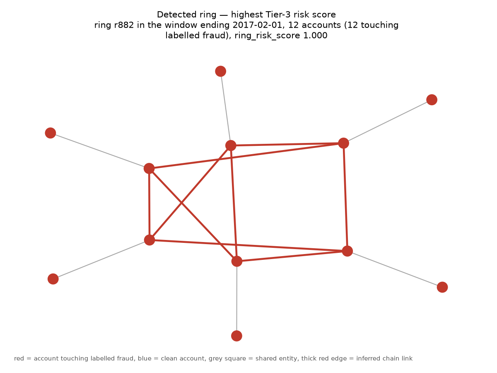
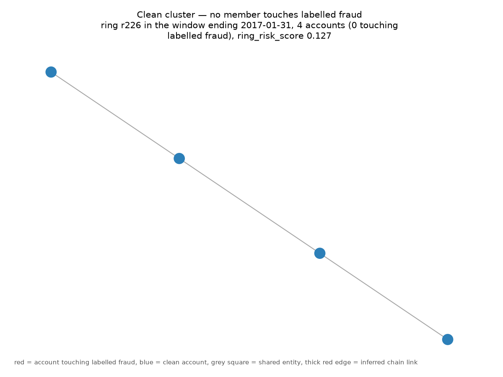

# Tier-3 — network graph abuse-ring detection (Phase 4)

Generated by `python -m app.models.train_tier3`. Every headline below is measured on the **held-out test split only**; validation numbers appear solely where a selection was made and are labelled as such.

## What the graph actually is, measured before it was built

PaySim's observed money-flow graph is a **star forest**: 99.95% of origins have degree 1, the maximum is 2, and only 341 of 2,291,054 nodes are both an origin and a destination. Louvain over that returns `groupby(nameDest)` and betweenness restates degree. The inferred transfer-to-cash-out chain edge is what creates multi-hop structure, and Phase 1 measured that it cannot be built on account names: 0.00% of fraudulent transfers have a `nameDest` reappearing as a fraudulent cash-out's `nameOrig`.

**That chain rule is also a simulator artefact.** Exact-amount same-step matching selects 99.50% of fraudulent transfers against 0.23% of legitimate ones, median one candidate partner. It is the generative rule read back out. Every PaySim number below is therefore reported against that rule as an explicit baseline, and the reportable claim is the increment over it — never the absolute figure.

IEEE-CIS has no money-flow edge at all, so its rings come from shared-entity co-occurrence. Its single columns are buckets rather than identifiers — `card4` and `card6` hold four values each, with 98,466 accounts on one — so entities are composite fingerprints under a degree cap.

## ieee_cis

- Configuration selected on **validation**: `entity_cap=200,all_fingerprints` (validation ring PR-AUC 0.5859 over 1,132 rings at a 0.133 ring base rate)
- Snapshot cadence 7 days 00:00:00, trailing window 30 days 00:00:00. Maximum score staleness is one cadence, 7 days 00:00:00.
- **Unit of analysis: the transaction.** Chosen on measured coverage, not declared in advance — see the note below where it is not the transaction.
- Abstention rate on test: **65.2%** of transactions had no ring and were abstained on, not scored as clean.

> **Most of this corpus's ring signal is circular with the account id.** `account_id` is constructed as `c{card1}_a{addr1}_d{d1n}`, and the winning fingerprint is `(card1, card2, card5, addr1)` — so two accounts sharing it differ *only* in `d1n`, the inferred account-start day. That is either one card fragmented into several inferred identities or one card genuinely presenting as several clients, and the graph cannot tell them apart. This is a structural claim, not a quantified one: no run in this repo compares the device-only (non-circular) fingerprint against the winning configuration at a matched `entity_cap`, so there is no clean before/after number for how much of the headline the circularity accounts for. The one non-circular run that does exist (`entity_cap=50,non_circular_only`, see the table below) is run at a *different* cap than the winner (`entity_cap=200`) and scores *higher* than the matched-cap circular run at `entity_cap=50` (0.3145 vs 0.2201), not lower — so it cannot be read as evidence the circular signal is doing most of the work either. Phase 9.5's audit flagged an earlier version of this note for claiming the opposite direction from what the table below shows.

### Configurations compared (validation)

| configuration | val ring PR-AUC | rings | base rate |
|---|---|---|---|
| `entity_cap=50,all_fingerprints` | 0.2201 | 1,683 | 0.093 |
| `entity_cap=200,all_fingerprints` **(selected)** | 0.5859 | 1,132 | 0.133 |
| `entity_cap=50,non_circular_only` | 0.3145 | 322 | 0.239 |

### Ring-level classification — held-out test

Unit of analysis is a **candidate ring**, declared rather than implied, the same move Phase 3 made in evaluating Tier-2 per account. Every detected ring is fraud-bearing or clean, so the confusion matrix is fully defined.

This corpus has **no chain edge and no pairing rule** — it carries no money-flow edge at all, so its rings come from shared-entity co-occurrence and the star filter is deliberately skipped. There is therefore no conditional-separation reading here: the base rate below is simply the share of detected communities that are fraud-bearing.

```
### tier3-ieee_cis-ring — held-out test (n=1,328, positives=143, base rate=10.7681%)
Threshold: 0.7851465236589958  (minimum estimated cost on validation rings, raised to respect a 1.0% review-capacity cap)

PR-AUC     0.6465  (95% CI 0.5700-0.7171)
           no-skill floor 0.1077 (6.0x lift)
Precision  0.8889      Recall  0.1119      F1  0.1988

Confusion matrix        Predicted
                     neg        pos
Actual  neg      1,183          2
        pos        127         16

False-positive cost estimate: 2,440,192.48 per 1,000 rings  [IEEE-CIS amount units (consistent with USD)]
  2 false positives x 15.00 = 30.00
  127 false negatives (amount + 15.00) = 3,240,545.61
  total = 3,240,575.61 over 1,328 rings
  flag rate = 1.36% (18 sent for review)
  Assumptions:
    - A false positive costs 15.00 IEEE-CIS amount units (consistent with USD) - analyst time on a manual review, or the lost margin and friction of declining a good customer.
    - A false negative costs the transaction amount plus a flat 15.00 - the chargeback fee and internal handling on top of the value lost.
    - Cost is linear in the number of mistakes: no queue-congestion effect, no customer-churn effect from repeated false declines, no recovery on disputed fraud. All three would raise the true cost of a false positive.
    - Every fraud is assumed to charge back. In practice some share is never disputed, which would lower false-negative cost.
    - Review capacity is unbounded. This is the assumption that bites hardest: the cost-minimising threshold below flags whatever share of traffic the arithmetic favours, with no ceiling on the queue it implies.
```

### Per-transaction ring risk — held-out test

```
### tier3-ieee_cis-transaction — held-out test (n=88,581, positives=3,083, base rate=3.4804%)
Threshold: 0.6785133318506584  (minimum estimated cost on validation transactions, raised to respect a 1.0% review-capacity cap)

PR-AUC     0.0314  (95% CI 0.0312-0.0317)
           no-skill floor 0.0348 (0.9x lift)
Precision  0.0113      Recall  0.0078      F1  0.0092

Confusion matrix        Predicted
                     neg        pos
Actual  neg     83,394      2,104
        pos      3,059         24

False-positive cost estimate: 5,876.27 per 1,000 transactions  [IEEE-CIS amount units (consistent with USD)]
  2,104 false positives x 3.00 = 6,312.00
  3,059 false negatives (amount + 15.00) = 514,213.85
  total = 520,525.85 over 88,581 transactions
  flag rate = 2.40% (2,128 sent for review)
  Assumptions:
    - A false positive costs 3.00 IEEE-CIS amount units (consistent with USD) - analyst time on a manual review, or the lost margin and friction of declining a good customer.
    - A false negative costs the transaction amount plus a flat 15.00 - the chargeback fee and internal handling on top of the value lost.
    - Cost is linear in the number of mistakes: no queue-congestion effect, no customer-churn effect from repeated false declines, no recovery on disputed fraud. All three would raise the true cost of a false positive.
    - Every fraud is assumed to charge back. In practice some share is never disputed, which would lower false-negative cost.
    - Review capacity is unbounded. This is the assumption that bites hardest: the cost-minimising threshold below flags whatever share of traffic the arithmetic favours, with no ceiling on the queue it implies.

65.2% of test transactions abstained (account absent from the snapshot or in a component below the minimum ring size). Abstentions rank last and never flag; they are not scored as clean.
```

> **This result does not clear its own no-skill floor.** Ranking transactions by ring risk alone is worse than random on this split. The layer's demonstrated value is at ring level, not per transaction, and this line is kept rather than dropped because a metrics section that shows only the numbers that worked is not an honest one.

### Incremental lift over Tier-1 — the number Phase 5 consumes

Tier-1 alone PR-AUC 0.5276 → Tier-1 + ring score 0.5244 (**-0.0031**, 95% CI -0.0038 to -0.0026)

The combiner is a logistic regression fitted on **validation**. Fitting it on test would void the comparison; fitting it on train would score Tier-1 in-sample on its own training window.

The interval excludes zero on the **negative** side: adding `ring_risk_score` to Tier-1 through a linear combiner makes the ranking *worse*, not better. Phase 5 must not treat this as a proven input. What the graph demonstrably does carry is ring-level structure (see the ring result above); what it does not carry is a per-transaction signal that improves Tier-1 under this fusion.

### Enrichment — the check that needs no surrogate

top-132 rings: 0.667 fraud-bearing against a 0.108 ring base rate (6.2x)

This view depends on no ground-truth partition, which is the whole of the check available here: **no surrogate recovery was computed for this corpus**, because the surrogate partition is built from PaySim's money-flow edges and this corpus has none. The corroboration is therefore weaker than on PaySim, where the two views agree.

### Cost sensitivity

ml-evaluation-standards section 3: a recommended threshold is justified by cost, and the recommendation has to survive the cost assumptions being wrong. Both sweeps re-choose the threshold at each setting, on the **validation** split, and are measured per transaction.

> **The two sweeps are not equally informative, and the first cannot be.** Scaling both cost parameters by the same factor multiplies total cost by that factor and therefore cannot move the argmin — the threshold is identical at 0.5x, 1.0x and 1.5x by construction, not as evidence of robustness. It is reported because section 3 names a +/-50% analysis, and it is labelled here so that its flatness is not read as a result. The **review-cost sweep below is the informative one**: it varies the false-positive-to-false-negative *ratio*, which is what the threshold actually depends on.

```
Both costs scaled (+/-50%)
  factor   threshold        total cost        FP        FN   flag rate
    0.5x     -1.000000        128,308.50    85,539         0    100.00%
    1.0x     -1.000000        256,617.00    85,539         0    100.00%
    1.5x     -1.000000        384,925.51    85,539         0    100.00%
```

```
Review cost raised against a fixed fraud cost
  factor   threshold        total cost        FP        FN   flag rate
    1.0x     -1.000000        256,617.00    85,539         0    100.00%
    5.0x    never flag        542,537.59         0     3,042      0.00%
   25.0x    never flag        542,537.59         0     3,042      0.00%
  100.0x    never flag        542,537.59         0     3,042      0.00%
```

### Recommended operating point

Threshold 0.678513 per transaction — flags **2.40%** of the population against a 1.0% review-capacity cap, at precision 0.0113 / recall 0.0078 / F1 0.0092.

### Latency

p50 0.003ms · p95 0.006ms · budget 50ms

Serving is a dictionary lookup into a precomputed score table. No graph algorithm runs in the request path, which is what makes Phase 7's Tier-3 timeout and degraded-mode fallback implementable.

### What this does NOT catch

- 79.1% of test fraud (2,438 of 3,083) was abstained on outright -- the account appeared in no ring at all, so Tier-3 could not have caught it at any threshold.
- 96.3% of scoreable test fraud sat in a ring but scored below the 0.6785 operating threshold.

## Visualisations

Both drawn from the PaySim money-flow graph. Red nodes are accounts touching labelled fraud, blue are clean, grey squares are shared entities, and a thick red edge is an inferred transfer-to-cash-out chain link.

The two may come from **different snapshot windows**, and each caption names its own. The detected ring is the riskiest in the most recent window; the clean cluster is the lowest-scoring ring in the most recent window that holds one with no fraud-touching member at all. That search is deliberate -- PaySim's ring base rate is well above a half, and the final window was measured to hold no clean ring at all, so taking the lowest-scoring ring in it would have put the word *clean* over a mostly-red graph.




